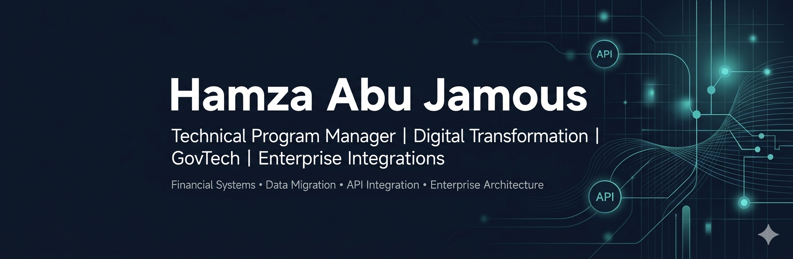

# Hamza Abu Jamous

**Technical Program Manager | Digital Transformation Consultant | GovTech & National Platforms | Enterprise Architecture | Enterprise Integrations | Financial Systems**

I work on digital transformation programs, national platforms, enterprise integrations, data migration, and financial system modernization.

My focus is on bridging business needs, technical delivery, enterprise architecture, vendors, infrastructure teams, and stakeholders to build reliable, scalable, and sustainable digital solutions.

---

## Core Focus Areas

- GovTech platforms and national digital services
- National digital programs and digital public infrastructure
- Enterprise architecture and solution design
- API-based and database-level system integrations
- Financial systems, payment workflows, and transaction processing
- Data migration, validation, reconciliation, and operational reporting
- Program governance, vendor coordination, and stakeholder alignment
- Systems modernization, process automation, and operational improvement

---

## Technical Stack & Integration Focus

---

## Programming & Development Stack

---

## Databases, Servers & Infrastructure

---

## What I Work On

I focus on designing, governing, and improving enterprise digital platforms and integration workflows, with emphasis on reliability, operational visibility, automation, scalability, and secure delivery.

My work typically involves translating business needs into structured technical requirements, aligning vendors and stakeholders, reviewing system architecture, supporting integration design, managing delivery risks, and improving operational workflows.

I am particularly interested in digital transformation programs that combine enterprise systems, public-sector platforms, financial workflows, APIs, data integration, dashboards, and AI-enabled automation.

---

## Professional Interests

- Digital transformation and GovTech modernization
- Enterprise integration and API modernization
- Financial systems and payment integrations
- Data migration, validation, and reconciliation workflows
- AI-assisted development and intelligent automation
- Executive dashboards and operational reporting
- Scalable architecture for national digital platforms
- Public-private digital service delivery

---

## Confidentiality Notice

Some of my work involves confidential enterprise, government, or client-related systems. For that reason, this profile may include sanitized case studies, generalized architecture examples, technical notes, or non-sensitive samples rather than production source code, implementation details, credentials, endpoints, business rules, or client-specific data.

---

## Connect

https://www.linkedin.com/in/hamza-abu-jamous/
